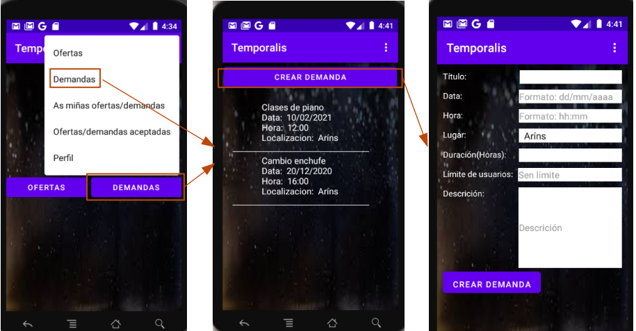
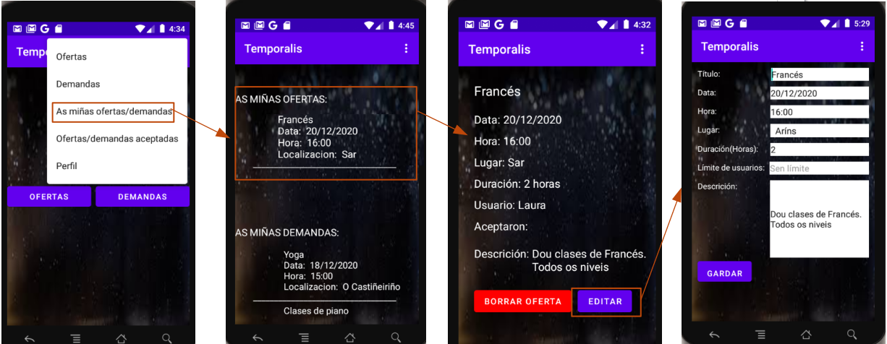
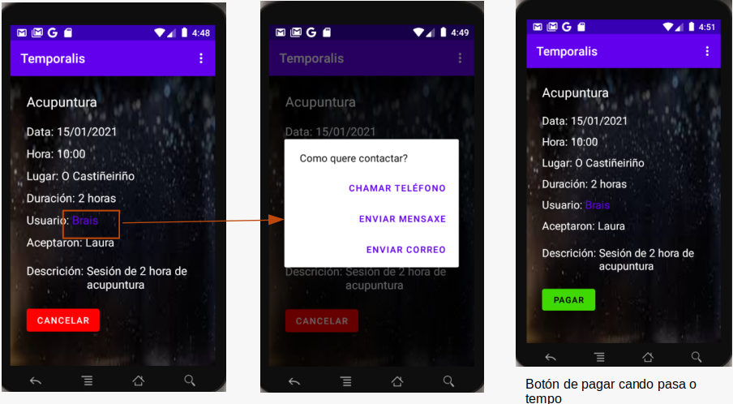

# Proyecto fin de ciclo
## Temporalis

## Descripción
>**Temporalis** é unha aplicación que axuda a implantación de un banco de tempo no concello de Santiago.  
**Que é un banco de tempo?**  
Un banco de tempo é un concepto no que persoas ofrecen servizos, coñecementos ou habilidades en intercambio por outros servizos coñecementos ou habilidades, dentro dunha relación na que o económico desaparece e a medida do valor de todo o achegado é o tempo que se invirte. Cada servizo, coñecemento ou habilidade intercambiada ten o mesmo valor, medido en unidades de tempo, independentemente de que o doante sexa un principiante ou un experto. Os intercambios desta maneira realmente o que premian é a solidariedade entre os integrantes do banco de tempo.   
**Como axuda Temporalis a axilizar esta iniciativa?**  
Fomentando a comunicación entre as persoas que queiran facer uso do banco de tempo e xestionando o mesmo mediante a creación de ofertas e demandas que precisen os usuarios. Cada usuario disporá de unha "conta de tempo" na que se lle irán sumando e restando horas en función do interese no ofertado ou demandado.   
## Instalación / Posta en marcha

>Actualmente unha vez descargado o repositorio podemos abrilo con Android Studio e se temos algún AVD descargado, ou un terminal móbil conectado podemos lanzar a aplicación a cal se instala automáticamente en este.  
Na imaxe podemos observar o AVD sobre o que se lanzará, Nexus One API 27 neste caso , e o botón de Start para lanzar a app.
  
>
>Nun futuro a aplicación poderase descargar da Play Store de Google e da aplicación para descargas Open Source F-Droid.

## Uso

>Ao lanzar a aplicación veremos unha pantalla de Login desde a cal poderemos entrar na aplicación co nome de usuario e o contrasinal e tamén poderemos entrar desde aquí a unha pantalla de rexistro, para gardar ao usuario que usará a aplicación. Ademais nesta pantalla contaremos con unha opción para entrar noutra interface na que se pode recuperar o nome de usuario e contrasinal no caso de que se lle esquecese ao usuario.  
  
>  
Unha vez dentro da app poderemos acceder ás ofertas e as demandas que hai rexistradas na BD.- É nesta pantalla onde poderemos clickar no botón de Crear Oferta ou Demanda (dependendo da pantalla na que nos atopemos) para poder rexistrar un novo Servizo.

>
>O usuario pode entrar desde o menú ás ofertas e demandas creadas por el e borralas e editalas se así o desexa. Se as borra ou edita mandaráselles un correo de aviso aos usuarios que aceptaran esta oferta.
  
>
>Existe tamén no menú un apartado para ver as ofertas e as demandas que o usuario aceptou e, se así o decide e antes de que chegue a data e a hora do servizo, poderá cancelalo e enviaráselle un correo de aviso ao usuario que o creou. Ademais desde este, se pinchamos no usuario que o creou neste caso, abrirase un pop-up para poder enviarlle un correo, ou chamalo ou enviarlle unha mensaxe se este ten o seu teléfono rexistrado.  
Unha vez pase o tempo do servizo aparecerá un botón para pagar as horas empregadas.

  
>
>Tamén no menú hai unha pestana de Perfil, na cal o usuario pode entrar a consultar o seu saldo de horas e modificar, se así o desexa o seu perfil de usuario.  

## Sobre o autor

>Actualmente estudando Desenvolvemento de Aplicacións Multiplataforma.  
Como tecnoloxías que máis domino:  
- Java, Python.
- HTML, CSS, XML, Bootstrap.
- MySQL, PostgreSQL, Microsoft SQL, MongoDB, MariaDB.
- Odoo, Git, LXC, Docker
>
>Decanteime por este proxecto porque quería crear unha app que se centrase nas persoas e nos seus intereses e necesidades e que non estivera centrado nun único servizo. Un banco do tempo é a iniciativa que cumple con estos requisitos, e unha app que xestione un é unha boa idea para esto.  
>
>Contacto:
  - Correo-e: **braisterbutalino@gmail.com**
  - GitHub: **https://github.com/braisab**
## Licencia

> [*GNU Free Documentation License Version 1.3*.](LICENSE.md)  
>
>Enlace:  
https://www.gnu.org/licenses/fdl-1.3.html

## Índice

1. Anteproyecto
    * 1.1. [Idea](doc/templates/1_idea.md)
    * 1.2. [Necesidades](doc/templates/2_necesidades.md)
2. [Análisis](doc/templates/3_analise.md)
3. [Planificación](doc/templates/4_planificacion.md)
4. [Diseño](doc/templates/5_deseño.md)
5. [Implantación](doc/templates/6_implantacion.md)

## Guía de contribución

> Pódese contribuir co desenvolvemento da aplicación no seguinte enlace:  
https://github.com/braisab/Temporalis
